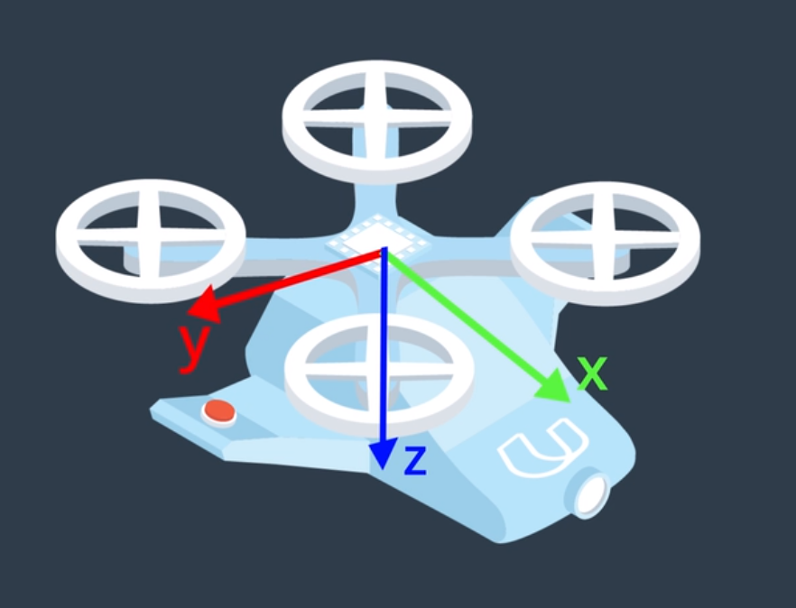
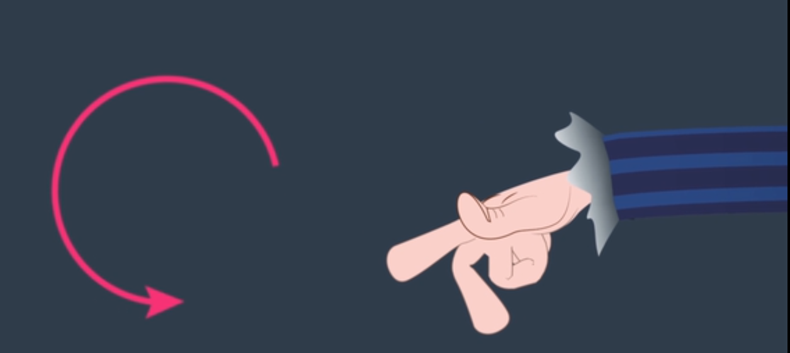
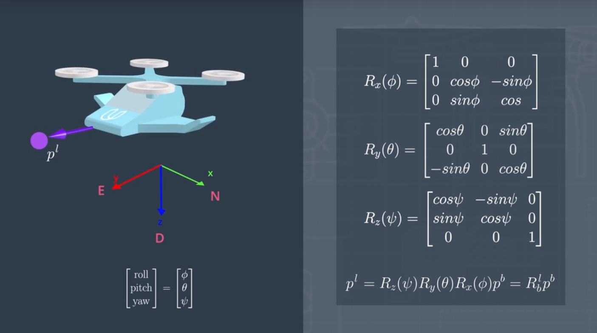

# AAE_Notebook_003_EulerAngles
This notebook explains the Body Frame of the vehicle and goes into the usage of Euler Angles and Rotation Matrices as a means by which to represent the vehicle's orientation with the Local ECEF Frame.

Once we've established a Local ECEF NED frame, we must take in account the Body Frame of the AAV. (Unlike the Local Frame, that gives us the coordinates of the AAV in relation to some origin, the Body Frame represents the physical body of the AAV.)

The Body Frame, with its origin on the body of the vehicle, such as the center of mass, will later be used to represent control inputs such as velocity and acceleration. It can also be used to keep track of the exact locations of sensors, such as the IMU (Inertial Measurement Unit) and camera, relative to one another, on the body of the vehicle. This comes in particularly useful, later, when using Sensor Fusion to 'fuse' together sensor readings.

Once we have the Body Frame of the vehicle, we're able to utilize the [Euler Angles](https://en.wikipedia.org/wiki/Euler_angles) Roll, Pitch, and Yaw.

Using the Right-Hand-Rule (RHR), counter-clockwise (CCW) motions are said to be positive. In example, a positive roll, as seen in the image above, is when the vehicle rotates CCW along the X-axis. 

** Note: aligning with the NED Frame, per the RRH, the Body Frame has the Z-axis being positive Down

Given a Body Frame and being familiar with Euler Angles, we can now represent the body of the vehicle as some location and orientation in space using a [Rotation Matrix](https://en.wikipedia.org/wiki/Rotation_matrix).

** Note: This system is considered to be 'over-parameterized' being as we must keep track of 9 numbers to represent the vehicles orientation. As we'll see in the next notebook, it is computationally less expensive to convert Euler Angles into Quaternions.
